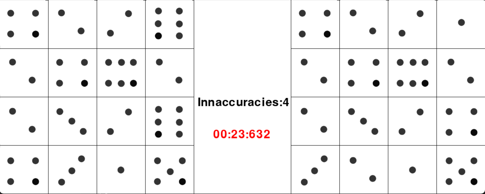
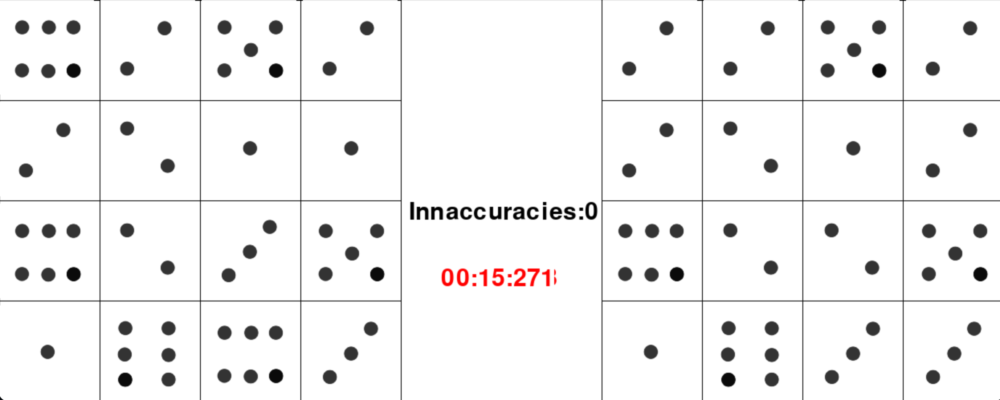

# SpotTheDifference

To play this game one must simply spot the differences from the image on the left compared to the image on the right. The purpose is to test the human
response speed and sharpen one's alertness. (inspired by https://www.smithsonianmag.com/games/spot-difference-180968040/)

To run the game, run the framework.py file.

You will then see the following pop-up: 

After choosing all inaccuracies, the timer will stop and the number of inaccuracies will decrease to zero:
